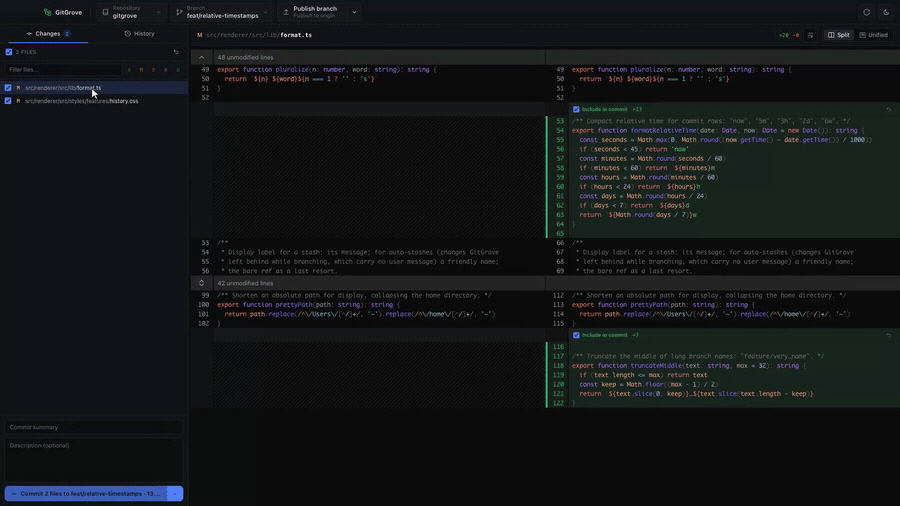

# 🌳 GitGrove

[](https://github.com/danipen/gitgrove/actions/workflows/ci.yml)
[](https://github.com/danipen/gitgrove/releases/latest)
[](LICENSE)

A fast, beautiful desktop git client. Open any repo to stage hunk by hunk, commit,
branch, sync, stash, rebase interactively — and read syntax‑highlighted diffs that
are a pleasure to look at, split or unified, light or dark.

GitGrove keeps a viewer's calm: one window, two tabs, no ceremony. The full power
of git is there when you reach for it, and invisible when you don't.

## Demo



A 75‑second tour: hunk‑level staging, syntax‑highlighted diffs, image diffs,
history & blame, conflict resolution, and interactive rebase — end to end.

<!--
  ▶ FULL‑RESOLUTION VIDEO (with sound) — to embed a real inline player on GitHub:
    1. Open this README on github.com and click the ✎ (edit) button.
    2. Drag the GitGrove.mp4 file into the editor. GitHub uploads it and inserts a
       https://github.com/user-attachments/assets/<id> URL.
    3. Paste that URL on its own line right below this comment (bare, not as a
       markdown link) — GitHub renders it as a video player.
  Alternatively, attach GitGrove.mp4 to a GitHub Release and link it here.
-->

## Features

- **No staging area.** Tick a checkbox to include a file — or expand it and tick a
  single hunk. Checkboxes are pure UI; staging happens at commit time, so you commit
  exactly what you mean, down to the line.
- **Commit, amend & stash without ceremony.** One composer with a mode switch: write a
  commit, amend the last one, or stash your work — each a single click.
- **Diffs that read themselves.** Syntax‑highlighted, split or unified, light or dark,
  rendered by [`@pierre/diffs`](https://diffs.com).
- **Image diffs.** Compare before/after *visually* — swipe, onion‑skin, or a
  pixel‑difference heatmap, with zoom and pan. PNG, JPEG, TGA, and more.
- **History & blame, actually usable.** A clean commit graph with author avatars; blame
  any file line‑by‑line to see who changed what, and when.
- **Conflicts, resolved calmly.** GitGrove flags conflicts *before* you merge, then walks
  you through each file — keep ours, take theirs, or compare side by side.
- **Interactive rebase, no terminal.** Reorder, squash, fixup, reword or drop commits from
  a dialog — the whole rebase is scripted behind the scenes, so no editor ever opens.
- **Cross‑platform & self‑updating.** macOS, Windows and Linux; checks for updates quietly
  and restarts in one click.

Two themes, one calm layout:


## Install

Download the latest version for your platform from the
[**Releases page**](https://github.com/danipen/gitgrove/releases/latest):

- **macOS** — `.dmg` (Intel / Apple Silicon)
- **Windows** — `.exe` installer (x64 / arm64)
- **Linux** — `.AppImage`

GitGrove updates itself: it checks quietly on launch and offers a one‑click restart
when a new version is ready. You can also check any time from **Help ▸ Check for
Updates…**

> **You'll need `git` installed.** GitGrove reads repositories through the `git`
> command line. If it isn't found, the app walks you through installing it (and will
> happily use the copy bundled with GitHub Desktop).

## Architecture

GitGrove is an [Electron](https://www.electronjs.org) + [React 19](https://react.dev)
app written in strict TypeScript, in three isolated layers:

```
src/main/      Node + Electron. All git work, by shelling out to the raw `git` binary.
src/preload/   Typed, sandboxed bridge (contextIsolation on, nodeIntegration off).
src/renderer/  React UI. Talks to the main process only through window.gitgrove.
src/shared/    Types + the IPC contract, imported by all three.
```

The renderer never touches git or Node directly. All git work happens in the main
process by shelling out to raw `git` with NUL‑delimited (`-z`/`%x00`) machine
output — no wrapper library, so every argument and exit code is under exact
control. Reads never take the index lock (`GIT_OPTIONAL_LOCKS=0`); writes are
serialized per repo behind a queue with a lock‑retry ladder, never prompt, and
inherit signing from your git config. The interactive rebase is fully scripted
through `GIT_SEQUENCE_EDITOR`/`GIT_EDITOR` shims, so no terminal editor ever
opens. Diffs are rendered with [`@pierre/diffs`](https://diffs.com).

## Development

You'll need [Bun](https://bun.sh) and `git` on your PATH.

```bash
bun install        # install dependencies
bun run dev        # launch the app with hot reload
bun run typecheck  # type-check the whole project
bun test           # run the test suite
bun run lint       # lint + format check (Biome) — same command CI runs
bun run lint:fix   # auto-fix lint + formatting
bun run e2e        # Playwright end-to-end smoke test (builds first)
```

Design principles, layer conventions and the bar every change is held to are
documented in [CLAUDE.md](CLAUDE.md). In short: clean, intent-revealing code;
small files; comments that explain *why*; and every new behaviour ships with
reliable, colocated unit tests (`*.test.ts`). Git tests are integration tests
that drive the real `git` binary against a throwaway repo — no mocks.

CI runs lint, typecheck, tests and a per‑platform build on every PR (macOS,
Windows, Linux), plus an end‑to‑end smoke test and a CodeQL scan — so green
locally means green in CI.

### Cutting a release

Releases are one button: **Actions ▸ Release ▸ Run workflow**, pick the bump level. The
workflow bumps the version, tags it, builds installers on every OS, and opens a draft
GitHub Release with generated notes. Review the notes (they show verbatim in the in‑app
update banner) and click **Publish**.

## Contributing

Bug reports and pull requests are welcome on the
[issue tracker](https://github.com/danipen/gitgrove/issues). Before opening a PR,
run `bun run lint`, `bun run typecheck` and `bun test`, and keep changes aligned
with the principles in [CLAUDE.md](CLAUDE.md) — fewer, sharper features over more
knobs, and a UI that stays silly‑simple while the engine does the real git work.

## License

GitGrove's own source is [MIT](LICENSE). It bundles open‑source dependencies under
their own permissive licenses; their notices ship inside every distributable.
